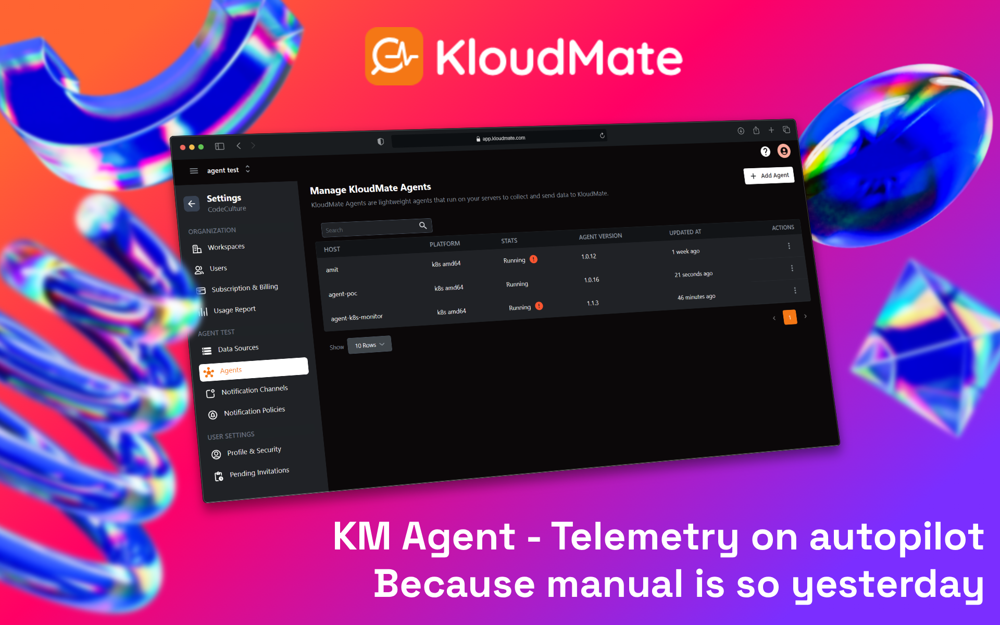
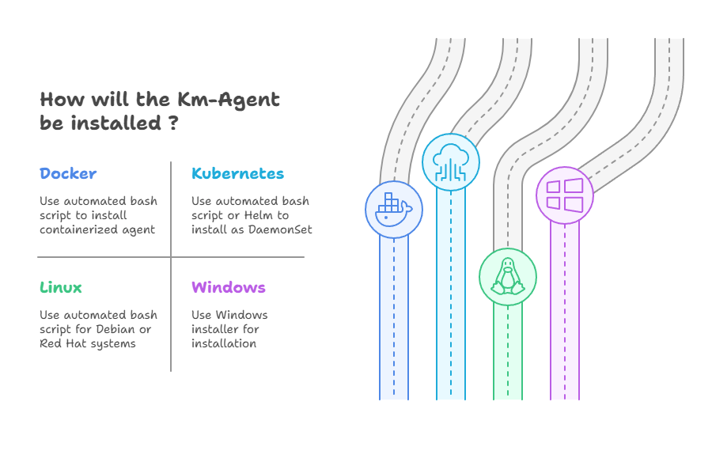
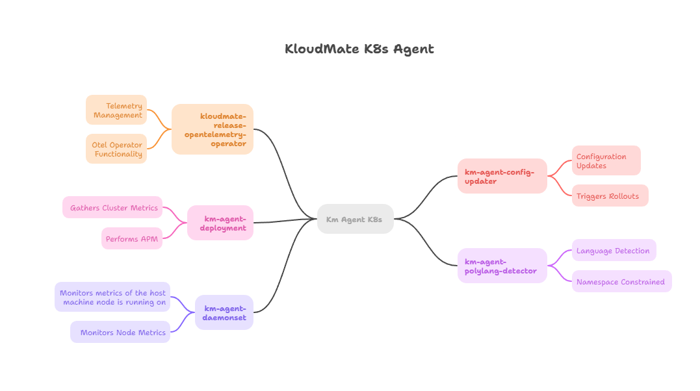

# KM-Agent

<div align="center">



[](https://opensource.org/licenses/Apache-2.0)
[](https://golang.org/)
[](https://github.com/ansh-devs/km-agent/releases)
[](https://github.com/ansh-devs/km-agent/actions)
[](https://hub.docker.com/r/kloudmate/km-agent)

**KloudMate Agent for OpenTelemetry Auto Instrumentation**

*Simplifying OpenTelemetry adoption through automated deployment and remote configuration*

 • [Official Documentation](https://docs.kloudmate.com/kloudmate-agents) 

</div>


### Key Problems Solved

- **Complex Configuration**: Eliminates the steep learning curve of OpenTelemetry Collector configuration
- **Manual Installation**: Provides automated installation scripts for multiple environments
- **Configuration Management**: Enables remote configuration through a web interface without SSH access

## Features

- 🚀 **Automated Installation**: One-command deployment across Linux, Docker, and Kubernetes
- 🌐 **Remote Configuration**: Configure agents through a web interface without your target machine access
- 📊 **Lifecycle Management**: Comprehensive management of OpenTelemetry Collector
- 🔍 **Synthetic Monitoring**: Built-in health checks and monitoring capabilities
- 🎯 **Multi-Platform Support**: Native support for various deployment environments
- 📈 **Real-time Dashboards**: Unique agent identification for centralized monitoring

### Installation

Choose your environment and run the appropriate installation command:

#### Docker Installation
Docker agent is containerized version of the Agent that collect host level metrics (via `hostmetricreceiver`) and logs (via the volume mounts)
User can install the agent by running below script

```bash
KM_API_KEY="<YOUR_API_KEY>" KM_COLLECTOR_ENDPOINT="https://otel.kloudmate.com:4318" bash -c "$(curl -L https://cdn.kloudmate.com/scripts/install_docker.sh)"
```

#### Linux Installation
Similar to native OTel agent, agent supports both debian and Red Hat based systems.
User can install the agent via this automated bash script

```bash
KM_API_KEY="<YOUR_API_KEY>" KM_COLLECTOR_ENDPOINT="https://otel.kloudmate.com:4318" bash -c "$(curl -L https://cdn.kloudmate.com/scripts/install_linux.sh)"
```

Bash script should have various configurable arguments to configure the agent apart from API_KEY which is required for authentication at exporter. Each of the script should have corresponding uninstall command to remove the agent from the system.

#### Kubernetes Installation
The agent will run as DaemonSet as well as a Deployment in the cluster and add necessary components to monitor the nodes and pods
User can install the agent using below Helm based instructioins
```bash
helm repo add kloudmate https://kloudmate.github.io/km-agent
helm repo update
helm install kloudmate-release kloudmate/km-kube-agent --namespace km-agent --create-namespace \
--set API_KEY="<YOUR_API_KEY>" \n --set COLLECTOR_ENDPOINT="https://otel.kloudmate.com:4318" \
--set clusterName="<YOUR_CLUSTER_NAME>" \
--set monitoredNamespaces="<MONITORED_NS>"
```

#### Windows Installation
Download and run the Windows (.exe) installer from our [releases page](https://github.com/kloudmate/km-agent/releases).


## Supported Environments



### Current Support
- ✅ **Linux** (Debian/Ubuntu, RHEL/CentOS)
- ✅ **Docker** (Host metrics and log collection)
- ✅ **Kubernetes** (via DaemonSet & Deployment)
- ✅ **Windows** (Windows Server 2016+)


### Architecture
Agent is installed as service on the host system/docker container/demonset on a k8s. It is done during installation process. The agent is responsible for managing the lifecycle of the Collector. The Agent is not an implementation of Collector, instead, it runs and manages lifecycle of existig OTel Collector.


It is also primarily responsible for watching remote configuration (via REST endpoint) and pass on the configuration to Collector when changes has been detected. It has other functionalities such as synthetic monitoring that can be used to monitor the agent's status, various logs for monitoring purpose etc.

Each agent is uniquely identifyable so it can be used to build dashboard for the user to monitor the agents and configure them using a web interface.


### Kubernetes Agent Architecture



The Kubernetes agent runs as a DaemonSet and includes:
- **Node Monitoring**: CPU, memory, disk, and network metrics
- **Pod Monitoring**: Container-level metrics and logs
- **Cluster Events**: Kubernetes events and resource monitoring
- **Service Discovery**: Automatic service endpoint detection

In future releases the agent can be installed in any of the following environments as well:
* Mac
* ECS
* Azure k8s


# Contribution Notice

Thank you for your interest in contributing to our project! We welcome contributions that improve the quality, usability, and functionality of this open-source initiative. Before you start, please review the following guidelines to ensure a smooth collaboration.


1. **Understand the Project**
   - Familiarize yourself with the purpose, scope, and goals of the project.
   - Read through the [Documentation](#) and [Code of Conduct](#) before proceeding.

2. **Report Issues**
   - Check if the issue is already reported in the [Issues](#) section.
   - If not, create a new issue with detailed steps to reproduce, expected behavior, and additional context.

3. **Propose Changes**
   - Open a [discussion](#) if you're unsure about your approach.
   - For substantial changes, start by discussing your ideas in an issue.

4. **Submit Pull Requests**
   - Fork the repository and create a new branch for your feature or bug fix.
   - Ensure your changes are well-documented and tested.
   - Submit a pull request with a clear description of the problem being solved.

5. **Follow Coding Standards**
   - Use consistent style and format as defined in the [Style Guide](#).
   - Include comments where necessary for readability and maintenance.

## Getting Started

1. Clone the repository:
   ```bash
   git clone https://github.com/kloudmate/km-agent.git

